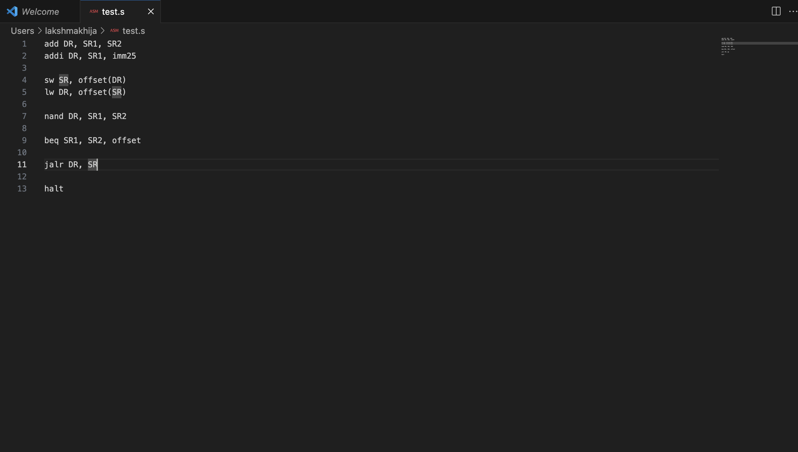

# CS2200 Assembly IntelliSense

🚀 A lightweight Visual Studio Code extension that provides **IntelliSense support** for the LC2200 Assembly Language used in Georgia Tech’s Systems & Architecture (CS 2200) course.

This extension helps students by offering **autocomplete, syntax highlighting, and instruction details** for LC2200 assembly programs.

---

## ✨ Features

- ✅ Autocomplete suggestions for LC2200 assembly instructions (`add`, `lea`, `jalr`, etc.)
- ✅ Inline documentation for each instruction (operand format, usage)
- ✅ Syntax highlighting for `.s` / `.asm` files
- ✅ Easy setup—just install and start coding!

Example: typing `ad` will suggest `add` along with its operand format:

---

## 📝 Usage

- Create or open a file with extension .s or .asm.
- Start typing an instruction (e.g., `lw`, `sw`, `add`) and IntelliSense will suggest completions.
- Hover over an instruction to see its expected operands.
- This is an example of what autocomplete adds:
  

---

## 👨‍💻 Author

Developed by Laksh Makhija
